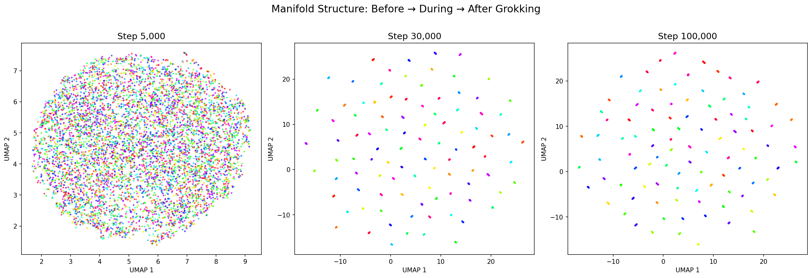
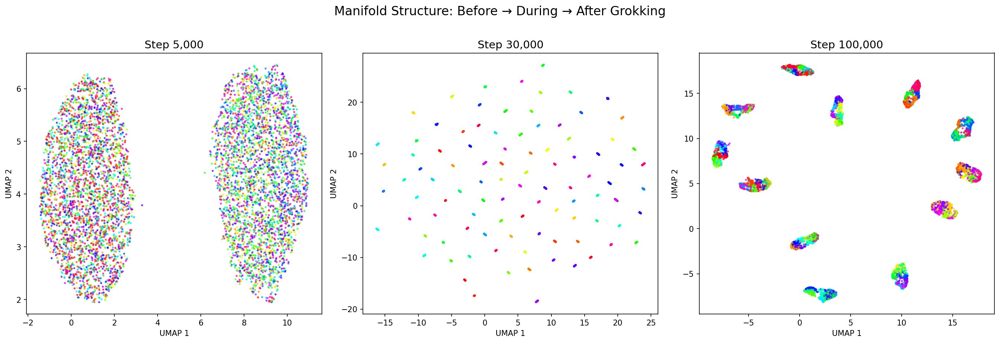

# Grokking as Manifold Discovery: Experiments

验证论文《Grokking 作为流形发现》的核心预测。

**论文核心假说**：Grokking = 从高维锯齿曲线到低维流形的拓扑相变

**论文链接**：[Zenodo](https://zenodo.org/records/18388631)

**详细实验结果**：[exp_result.md](exp_result.md)

---

## 快速开始

```bash
# 进入 Docker 容器
sudo docker exec -it magical_bhabha bash

# 运行实验
cd /workspace/ai-theorys-study/arxiv/wechat67/code/
# 实验组1：模加法
cd /workspace/ai-theorys-study/arxiv/wechat67/exp_group1_addition/code/
python train_grokking.py      # 训练
python estimate_dimension.py  # 实验1：维度分析
python compute_topology.py    # 实验2：拓扑分析
python analyze_entropy.py     # 实验3：激活分析
python visualize_manifold.py  # 实验5：流形可视化

# 实验组2：模乘法
cd /workspace/ai-theorys-study/arxiv/wechat67/exp_group2_multiplication/code/
python train_grokking.py      # 训练
python estimate_dimension.py  # 维度分析
python compute_topology.py    # 拓扑分析
python analyze_entropy.py     # 激活分析
python visualize_manifold.py  # 流形可视化
python train_bottleneck.py    # 瓶颈实验

# 补充实验（两组通用）
python analyze_adjacency.py   # 邻接关系分析
python train_multi_seed.py    # 多 seed 稳定性验证
```

---

## 两组实验对比

| 指标 | 模加法 | 模乘法 |
|------|--------|--------|
| 维度变化 | 78 → 8 | 89 → 11 |
| 瓶颈临界点 | 8-16 维 | 16-32 维 |
| 最终结构 | 97 个簇 | 12 个陪集 |
| 邻接得分 | 0%（无环结构） | 100%（完美 Z₁₂ 环） |
| 多 seed 成功率 | 2/3 (67%) | 2/3 (67%) |
| 假说验证 | ✅ | ✅ |

## 五个实验（模加法）

| 实验 | 假说 | 结果 | 状态 |
|------|------|------|------|
| 1. 内在维度 | Grokking 时维度骤降 | 78 → 8 | ✅ |
| 2. 拓扑结构 | 低维结构涌现 | 500 → 6 连通分量 | ✅ |
| 3. 激活动态 | 激活模式质变 | L2/Std 同步震荡 | ✅ |
| 4. 秩约束 | 存在维度下界 | 瓶颈 ≤8 无法 Grok | ✅ |
| 5. 流形可视化 | 直接看到流形结构 | 乱点 → 97 个簇 | ✅ |

---

## 核心发现

1. **流形发现假说成立**：两种运算都观察到维度骤降（78→8, 89→11）
2. **临界态震荡**：模型在泛化/记忆之间反复跳跃（12-20 次震荡）
3. **Grokking 成功率 ~67%**：多 seed 实验显示相变不是必然，有 1/3 概率卡死
4. **表示维度下界**：加法 8-16 维，乘法 16-32 维（与任务复杂度相关）
5. **陪集结构验证**：模乘法学到 Z₁₂ 商群结构（纯度 99.4%，邻接 100%）
6. **拓扑保持差异**：模乘法保持环形拓扑，模加法只学到离散等价类

| 模加法 | 模乘法 |
|--------|--------|
|  |  |

---

## 目录结构

```
.
├── README.md                    # 本文件
├── exp_result.md                # 详细实验结果
├── paper/                       # 论文（中英文 + PDF）
├── exp_group1_addition/         # 实验组1：模加法
│   ├── code/                    # 实验代码
│   └── results/                 # 实验结果和图表
└── exp_group2_multiplication/   # 实验组2：模乘法
    ├── code/                    # 实验代码
    └── results/                 # 实验结果和图表
```
