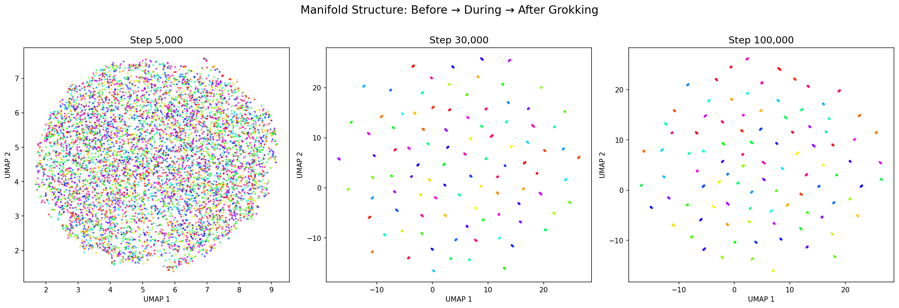
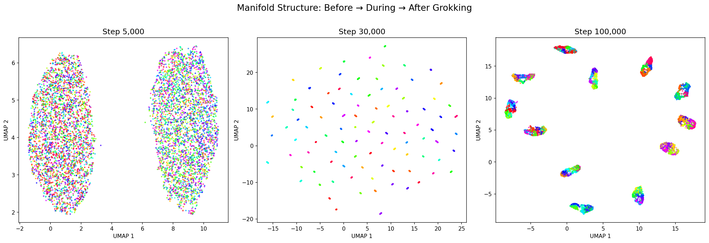

# Grokking as Manifold Discovery: Experiments
# Grokking 作为流形发现：实验验证

Verifying the core predictions of the paper "Grokking as Manifold Discovery".
验证论文《Grokking 作为流形发现》的核心预测。

**Core Hypothesis / 核心假说**：Grokking = a topological phase transition from high-dimensional jagged curves to low-dimensional manifolds / 从高维锯齿曲线到低维流形的拓扑相变

**Paper Link / 论文链接**：[Zenodo](https://zenodo.org/records/18731171)

**Detailed Experiment Results / 详细实验结果**：[exp_result.md](exp_result.md)

---

## Quick Start / 快速开始

```bash
# 进入 Docker 容器
sudo docker exec -it magical_bhabha bash

# 运行实验
cd /workspace/ai-theorys-study/arxiv/wechat67/code/
# 实验组1：模加法
cd /workspace/ai-theorys-study/arxiv/wechat67/exp_group1_addition/code/
python train_grokking.py      # 训练
python estimate_dimension.py  # 实验1：维度分析
python compute_topology.py    # 实验2：拓扑分析
python analyze_entropy.py     # 实验3：激活分析
python visualize_manifold.py  # 实验5：流形可视化

# 实验组2：模乘法
cd /workspace/ai-theorys-study/arxiv/wechat67/exp_group2_multiplication/code/
python train_grokking.py      # 训练
python estimate_dimension.py  # 维度分析
python compute_topology.py    # 拓扑分析
python analyze_entropy.py     # 激活分析
python visualize_manifold.py  # 流形可视化
python train_bottleneck.py    # 瓶颈实验

# 补充实验（两组通用）
python analyze_adjacency.py   # 邻接关系分析
python train_multi_seed.py    # 多 seed 稳定性验证
```

---

## Comparison of Two Experiment Groups / 两组实验对比

| Metric / 指标 | Modular Addition / 模加法 | Modular Multiplication / 模乘法 |
|------|--------|--------|
| Dimension change / 维度变化 | 78 → 8 | 89 → 11 |
| Bottleneck critical point / 瓶颈临界点 | 8-16 dim / 8-16 维 | 16-32 dim / 16-32 维 |
| Final structure / 最终结构 | 97 clusters / 97 个簇 | 12 cosets / 12 个陪集 |
| Adjacency score / 邻接得分 | 0% (no ring structure / 无环结构) | 100% (perfect Z₁₂ ring / 完美 Z₁₂ 环) |
| Multi-seed success rate / 多 seed 成功率 | 2/3 (67%) | 2/3 (67%) |
| Hypothesis verification / 假说验证 | ✅ | ✅ |

## Five Experiments (Modular Addition) / 五个实验（模加法）

| Experiment / 实验 | Hypothesis / 假说 | Result / 结果 | Status / 状态 |
|------|------|------|------|
| 1. Intrinsic dimension / 内在维度 | Dimension drops sharply during grokking / Grokking 时维度骤降 | 78 → 8 | ✅ |
| 2. Topological structure / 拓扑结构 | Low-dimensional structure emerges / 低维结构涌现 | 500 → 6 connected components / 连通分量 | ✅ |
| 3. Activation dynamics / 激活动态 | Qualitative change in activation patterns / 激活模式质变 | L2/Std synchronized oscillation / 同步震荡 | ✅ |
| 4. Rank constraint / 秩约束 | Dimension lower bound exists / 存在维度下界 | Bottleneck ≤8 cannot grok / 瓶颈 ≤8 无法 Grok | ✅ |
| 5. Manifold visualization / 流形可视化 | Manifold structure directly visible / 直接看到流形结构 | Random points → 97 clusters / 乱点 → 97 个簇 | ✅ |

---

## Core Findings / 核心发现

1. **Manifold discovery hypothesis confirmed / 流形发现假说成立**: Both operations show sharp dimension drops (78→8, 89→11) / 两种运算都观察到维度骤降（78→8, 89→11）
2. **Critical state oscillation / 临界态震荡**: The model repeatedly jumps between generalization and memorization (12-20 oscillations) / 模型在泛化/记忆之间反复跳跃（12-20 次震荡）
3. **Grokking success rate ~67% / Grokking 成功率 ~67%**: Multi-seed experiments show that phase transition is not inevitable, with a 1/3 probability of getting stuck / 多 seed 实验显示相变不是必然，有 1/3 概率卡死
4. **Representation dimension lower bound / 表示维度下界**: Addition 8-16 dim, multiplication 16-32 dim (correlated with task complexity) / 加法 8-16 维，乘法 16-32 维（与任务复杂度相关）
5. **Coset structure verified / 陪集结构验证**: Modular multiplication learns the Z₁₂ quotient group structure (purity 99.4%, adjacency 100%) / 模乘法学到 Z₁₂ 商群结构（纯度 99.4%，邻接 100%）
6. **Topological preservation difference / 拓扑保持差异**: Modular multiplication preserves ring topology, modular addition only learns discrete equivalence classes / 模乘法保持环形拓扑，模加法只学到离散等价类

| Modular Addition / 模加法 | Modular Multiplication / 模乘法 |
|--------|--------|
|  |  |

---

## Experiment Group 3: Nested Grokking / 实验组3：嵌套 Grokking

**Core discovery / 核心发现**: A model can maintain 100% test accuracy while its internal representation undergoes complete reorganization. The "brain" changes but the behavior doesn't.

**核心发现**：模型可以在测试准确率始终 100% 的情况下，内部表示发生完全重组。"脑子"换了一遍，但行为纹丝不动。

Group 2 discovered that the model learns Z₁₂ coset structure but memorizes the 8 elements within each coset (Z₈). We increased Weight Decay to force deeper learning. What happened: not nested emergence, but **topological possession** — under WD pressure, the outer Z₁₂ structure collapses and is replaced by a stride=4 encoding (= gcd(12,8)). The model autonomously discovers this mathematical shortcut. Throughout this internal revolution, test accuracy stays at 100%.

实验组2 发现模型学会了 Z₁₂ 陪集结构，但每个陪集内部的 8 个元素（Z₈）是死记硬背的。我们加大 Weight Decay 逼它继续学。结果：不是嵌套涌现，而是**拓扑夺舍**——在 WD 压力下，外层 Z₁₂ 结构坍塌，被 stride=4 编码（= gcd(12,8)）取代。模型自主发现了这条数学捷径。在整个内部革命过程中，测试准确率始终 100%。

**Scaling experiment / 扩容实验**: A larger model (4-layer, 256-dim, ~800K params) with the same WD=2.0 **failed to Grok** (test_acc=51.75%). The model briefly touched perfect topology at steps 360K (outer_s1=1.0) and 380K (inner_s4=1.0), but could not stabilize either. Conclusion: capacity and regularization pressure must match — a bigger house without enough gravity grows no galaxies.

**扩容实验**：更大的模型（4层256维，约80万参数）在相同 WD=2.0 下**未能 Grok**（test_acc=51.75%）。模型在 360K 步（outer_s1=1.0）和 380K 步（inner_s4=1.0）瞬间触碰到完美拓扑，但无法稳定。结论：容量和正则化压力必须匹配——没有重力的大房子，长不出星系。

**Details / 详情**：[exp_group3_nested_grokking/README.md](exp_group3_nested_grokking/README.md)

---

## Directory Structure / 目录结构

```
.
├── README.md                    # 本文件
├── exp_result.md                # 详细实验结果
├── paper/                       # 论文（中英文 + PDF）
├── exp_group1_addition/         # 实验组1：模加法
│   ├── code/                    # 实验代码
│   └── results/                 # 实验结果和图表
├── exp_group2_multiplication/   # 实验组2：模乘法
│   ├── code/                    # 实验代码
│   └── results/                 # 实验结果和图表
└── exp_group3_nested_grokking/  # 实验组3：嵌套 Grokking / 拓扑夺舍
    ├── code/                    # 实验代码
    └── results/                 # 多档 WD 对比结果
```
