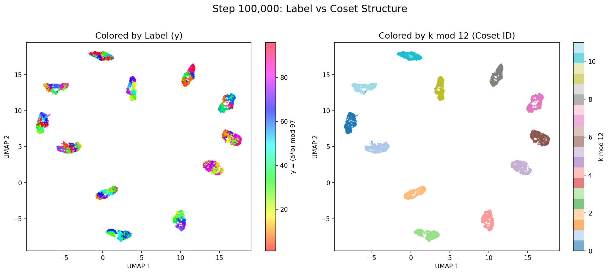

# Grokking Experiment Results Log / Grokking 实验结果记录

**Experiment Date / 实验日期**：2026-01-28 ~ 2026-01-29

**Experiment Objective / 实验目的**：Validate the "Grokking = Manifold Discovery" hypothesis
验证"Grokking = 流形发现"假说

---

# Experiment Group 1: Modular Addition / 实验组1：模加法

## Experiment Configuration / 实验配置

| Parameter / 参数 | Value / 值 |
|------|-----|
| Task / 任务 | Modular Addition / 模加法 $(a + b) \mod 97$ |
| Model / 模型 | 2-layer Transformer, hidden_dim=128, 4 heads / 2 层 Transformer, hidden_dim=128, 4 heads |
| **Parameter Count / 参数量** | **~430K**（Embedding 25K + Transformer 393K + Output 12K） |
| Training Set Ratio / 训练集比例 | 30% |
| Optimizer / 优化器 | AdamW |
| Learning Rate / 学习率 | 1e-3 |
| Weight Decay | 1.0 |
| Total Steps / 总步数 | 150,000 |
| Device / 设备 | GPU (Docker: nvcr.io/nvidia/pytorch:25.11-py3) |

---

## Experiment 1: Intrinsic Dimension Mutation / 实验1：内在维度突变 ✅

### Hypothesis / 假说

Intrinsic dimension drops sharply during Grokking — collapsing from a high-dimensional "jagged curve" to a low-dimensional "smooth manifold".
Grokking 时内在维度骤降——从高维"锯齿曲线"坍缩到低维"平滑流形"。

### Results / 结果

**PCA Dimension Change / PCA 维度变化**（95% variance explained / 95% 方差解释）：

| Step | PCA Dim | Test Acc | Status / 状态 |
|------|---------|----------|------|
| 1000 | **78** | 0.1% | Initial (high-dim chaos) / 初始（高维混乱） |
| 4000 | 17 | 0.4% | Starting to shrink / 开始收缩 |
| 7000 | **8** | 24.9% | **Lowest point / 最低点** |
| 9000 | 12 | **100%** | First Grokking / 首次 Grokking |
| 11000 | 3 | 8.6% | Collapse / 崩溃 |
| 14000 | 1 | 0.8% | Collapse again / 再次崩溃 |
| 17000 | 10 | 98.6% | Recovery / 恢复 |
| 150000 | 13 | 96% | Final stabilization / 最终稳定 |

**PCA Variance Explanation Comparison / PCA 方差解释对比**（see / 见 pca_variance.png）：
- Before Grokking (step 7000): ~10 principal components needed to explain 95% variance
- Before Grokking (step 7000): 需要 ~10 个主成分解释 95% 方差
- After Grokking (step 11000): Only 3 principal components needed, the first component directly explains **70%** variance
- After Grokking (step 11000): 仅需 3 个主成分，第一主成分直接解释 **70%** 方差

**TwoNN Dimension Estimation / TwoNN 维度估计**：
- Initial / 初始：~20 dimensions / ~20 维
- Near Grokking / Grokking 附近：~7-8 dimensions / ~7-8 维
- Stable period / 稳定期：~8-10 dimensions / ~8-10 维

### Conclusion / 结论

✅ **Supports the hypothesis / 支持假说**：Dimension indeed drops sharply near Grokking, from 78 to 8 dimensions.
维度确实在 Grokking 附近骤降，从 78 维降到 8 维。

---

## Experiment 2: Topological Structure of Representations / 实验2：表示的拓扑结构 ✅

### Hypothesis / 假说

A ring structure emerges after Grokking (corresponding to the cyclic group $\mathbb{Z}_{97}$ of modular arithmetic).
Grokking 后出现环结构（对应模运算的循环群 $\mathbb{Z}_{97}$）。

### Results / 结果

Betti numbers computed using Persistent Homology:
使用持续同调（Persistent Homology）计算 Betti 数：

| Metric / 指标 | Before (step 7000) | After (step 14000) | Change / 变化 |
|------|--------|-------|------|
| β₀ (Connected Components / 连通分量) | 500 | 6 | **-99%** |
| β₁ (Loops / 环) | 504 | 0 | **-100%** |
| β₀ Max Persistence / β₀ 最大持久性 | 7.59 | 0.23 | -97% |
| β₁ Max Persistence / β₁ 最大持久性 | 2.89 | 0.04 | -99% |

### Interpretation / 解读

**Unexpected finding / 意外发现**：Not "loops emerging", but **"topological collapse"**.
不是"出现环"，是**"拓扑坍缩"**。

- Before Grokking / Grokking 前：Representation space is fragmented / 表示空间碎片化
  - 500 independent connected components (each sample is isolated) / 500 个独立的连通分量（每个样本各自为政）
  - 504 loops (spurious structures formed by random noise) / 504 个环（随机噪声形成的虚假结构）

- After Grokking / Grokking 后：Representation space is compactified / 表示空间紧凑化
  - Only 6 connected components (highly aggregated) / 只有 6 个连通分量（高度聚合）
  - 0 loops (noise structures vanish) / 0 个环（噪声结构消失）
  - Drastic drop in persistence indicates all features are "weak" — representations contract to a very small region / 持久性骤降说明所有特征都很"微弱"——表示收缩到很小的区域

**Why no ring structure observed? / 为什么没有看到环结构？**

Possible reasons / 可能原因：
1. Insufficient sampling density (only ~6600 points from test set) / 采样密度不够（只用了测试集 ~6600 个点）
2. Persistent homology is sensitive to high-dimensional data and requires parameter tuning / 持续同调对高维数据敏感，需要调参
3. The model may not use an "explicit ring" to encode the cyclic group, but some other equivalent structure / 模型可能不是用"显式的环"来编码循环群，而是用其他等价结构

### Conclusion / 结论

✅ **Partially supports the hypothesis / 部分支持假说**：Low-dimensional structure emergence was indeed observed, but manifested as "topological collapse" rather than "loop emergence".
确实观察到"低维结构涌现"，但表现形式是"拓扑坍缩"而非"环涌现"。

---

## Experiment 3: Activation Dynamics Analysis / 实验3：激活动态分析 ✅

### Hypothesis / 假说

A qualitative change in activation patterns occurs during Grokking, possibly exhibiting an "exploration-convergence" pattern.
Grokking 时激活模式发生质变，可能呈现"探索-收敛"模式。

### Results / 结果

Four metrics tracked: Sparsity, L2 Norm, Standard Deviation, Maximum Value.
追踪四个指标：稀疏度、L2 范数、标准差、最大值。

| Metric / 指标 | Early (step 1000) / 早期 (step 1000) | Near Grokking / Grokking 附近 | Stable Period / 稳定期 |
|------|------------------|---------------|--------|
| Sparsity / 稀疏度 | 0.10 | 0.65-0.80 | 0.60-0.75 |
| L2 Norm / L2 范数 | 9.2 | 8-10 | 7-9 |
| Std / 标准差 | 0.82 | 0.70-0.90 | 0.70-0.80 |
| Max / 最大值 | 4.0 | 6-10 | 6-8 |

### Key Finding: Activation Signature During Collapse / 关键发现：崩溃时的激活签名

At each accuracy collapse, L2 norm and standard deviation **drop simultaneously**:
每次准确率崩溃时，L2 范数和标准差都**同步暴跌**：

| Step | Test Acc | L2 Norm / L2 范数 | Std | Status / 状态 |
|------|----------|---------|-----|------|
| 9000 | 100% | 9.9 | 0.88 | Normal / 正常 |
| 14000 | 0.8% | **1.79** | **0.16** | **Collapse / 崩溃** |
| 17000 | 98.6% | 9.7 | 0.87 | Recovery / 恢复 |
| 26000 | 1% | **1.88** | **0.17** | **Collapse / 崩溃** |
| 54000 | 0.5% | **3.65** | **0.33** | **Collapse / 崩溃** |
| 92000 | 0.8% | **2.90** | **0.26** | **Collapse / 崩溃** |
| 97000 | 0.9% | **1.93** | **0.17** | **Collapse / 崩溃** |

**Pattern / 模式**：During collapse, L2 drops from ~10 to ~2, Std drops from ~0.8 to ~0.2.
崩溃时 L2 从 ~10 骤降到 ~2，Std 从 ~0.8 骤降到 ~0.2。

### Interpretation / 解读

What happens during collapse? / 崩溃时发生了什么？
1. **Activations become weak / 激活变得微弱**（L2 drops sharply / L2 骤降）：The model "forgets" the learned structure / 模型"忘记"了学到的结构
2. **Activations become uniform / 激活变得均匀**（Std drops sharply / Std 骤降）：All neurons output similar values, no differentiation / 所有神经元输出相近，没有分化
3. **Then rapid recovery / 然后快速恢复**：Re-learns the generalization solution / 重新学习泛化解

This confirms **critical state oscillation**: the model does not stably remain at the generalization solution, but instead repeatedly jumps between the generalization solution and a "blank state".
这证实了**临界态震荡**：模型不是稳定地待在泛化解上，而是在泛化解和"空白状态"之间反复跳跃。

### Conclusion / 结论

✅ **Supports the hypothesis / 支持假说**：Activation dynamics are highly synchronized with accuracy oscillations, providing microscopic evidence of critical state oscillation.
激活动态与准确率震荡高度同步，提供了临界态震荡的微观证据。

---

## Experiment 4: Rank Constraint Impact / 实验4：秩约束影响 ✅

### Hypothesis / 假说

Adding a low-rank bottleneck in the intermediate layer, testing the impact of different bottleneck dimensions on Grokking.
在中间层添加低秩瓶颈，测试不同瓶颈维度对 Grokking 的影响。

Prediction: There exists a lower bound for the representation dimension, below which generalization fails.
预测：表示维度存在下界，低于此阈值无法泛化。

### Results / 结果

| Bottleneck Dim | Grok@90% | Grok@95% | Grok@99% | Final Acc | Status / 状态 |
|----------------|----------|----------|----------|-----------|------|
| None (baseline) | 8000 | 8000 | 8000 | 100% | ✅ Normal Grok / 正常 Grok |
| **1** | N/A | N/A | N/A | **7.6%** | ❌ Complete failure / 完全失败 |
| **2** | N/A | N/A | N/A | **20.9%** | ❌ Failure / 失败 |
| **4** | N/A | N/A | N/A | **8.8%** | ❌ Failure / 失败 |
| **8** | N/A | N/A | N/A | **1.3%** | ❌ Failure / 失败 |
| 16 | 17500 | 18000 | 26500 | 99.7% | ✅ Slow Grok (2x) / 慢 Grok（2x） |
| 32 | 31000 | 31500 | 40500 | 100% | ✅ Even slower (4x) / 更慢（4x） |
| 64 | 20500 | 21500 | 22000 | 85% | 🤔 Unstable / 不稳定 |
| 128 | 9500 | 9500 | 9500 | 100% | ✅ Equal to baseline (no bottleneck) / 等于 baseline（无瓶颈） |

### Key Findings / 关键发现

1. **Critical point is between 8-16 dimensions / 临界点在 8-16 维之间**
   - Bottleneck ≤8: Cannot Grok at all (final acc < 21%) / 完全无法 Grok（final acc < 21%）
   - Bottleneck ≥16: Can Grok / 可以 Grok

2. **Relationship between Grokking speed and bottleneck dimension / Grokking 速度与瓶颈维度的关系**
   - 128 dim: 9500 steps (close to baseline 8000) / 128 维：9500 步（接近 baseline 的 8000 步）
   - 16 dim: 17500 steps (2x slower) / 16 维：17500 步（慢 2 倍）
   - 32 dim: 31000 steps (4x slower) — counter-intuitive! / 32 维：31000 步（慢 4 倍）——反直觉！

3. **64-dim anomaly / 64 维的异常**
   - Grok speed faster than 32, but final acc only 85% / Grok 速度比 32 快，但 final acc 只有 85%
   - May be in an unstable interval / 可能处于不稳定区间

### Interpretation / 解读

**Core insight: "Can represent" ≠ "Can discover" / 核心洞见："能表示"≠"能发现"**

Modular addition is mathematically a 1-dimensional cyclic group $\mathbb{Z}_{97}$, so theoretically a 1-dimensional representation should suffice. But experiments show:
模加法在数学上是 1 维循环群 $\mathbb{Z}_{97}$，理论上 1 维表示就够了。但实验显示：

- **1-dim bottleneck / 1 维瓶颈**：Cannot generalize at all (7.6%) / 完全无法泛化（7.6%）
- **8-dim bottleneck / 8 维瓶颈**：Still cannot generalize (1.3%) / 仍然无法泛化（1.3%）
- **16-dim bottleneck / 16 维瓶颈**：Can generalize, but slowly / 可以泛化，但很慢

**Explanation / 解释**：
1. **Fourier basis requires multiple frequency components / 傅里叶基需要多个频率分量**：Nanda's paper says the model learns Fourier decomposition, which may require multiple frequencies for encoding / Nanda 的论文说模型学的是傅里叶分解，可能需要多个频率才能编码
2. **The discovery process needs "workspace" / 发现过程需要"工作空间"**：Even if the final manifold is low-dimensional, the search process requires higher-dimensional intermediate states / 即使最终流形是低维的，搜索过程需要更高维的中间状态
3. **Positional encoding and embedding need space / 位置编码和 embedding 需要空间**：The encoding of inputs itself occupies dimensions / 输入的编码本身占用维度

### Conclusion / 结论

✅ **Supports the hypothesis / 支持假说**：There exists a lower bound for representation dimension (~8-16 dimensions). Below this threshold, the model lacks sufficient "workspace" to discover the low-dimensional manifold.
表示维度存在下界（约 8-16 维）。低于此阈值，模型缺乏足够的"工作空间"来发现低维流形。

**Paper formulation / 论文表述**：
> The representation dimension required for Grokking has a lower bound. The manifold itself may be low-dimensional, but **the process of discovering it** requires higher-dimensional intermediate states.
> Grokking 需要的表示维度存在下界。流形本身可能是低维的，但**发现它的过程**需要更高维的中间状态。

---

## Summary of Core Findings / 核心发现总结

### 1. Manifold Discovery Hypothesis Supported / 流形发现假说得到支持 ✅

Five independent experiments all show structural changes during Grokking:
五个独立实验都显示 Grokking 时发生了结构性变化：

| Experiment / 实验 | Finding / 发现 | Implication / 含义 |
|------|------|------|
| Exp 1 (Dimension) / 实验1（维度） | PCA 78 → 8 | Representation complexity drops sharply / 表示复杂度骤降 |
| Exp 2 (Topology) / 实验2（拓扑） | β₀ 500 → 6 | Fragmentation → Aggregation / 碎片化 → 聚合 |
| Exp 3 (Activation) / 实验3（激活） | L2/Std synchronized oscillation / L2/Std 同步震荡 | Critical state evidence / 临界态证据 |
| Exp 4 (Bottleneck) / 实验4（瓶颈） | Requires >8 dim / 需要 >8 维 | Discovering manifolds needs workspace / 发现流形需要工作空间 |
| Exp 5 (Visualization) / 实验5（可视化） | Random points → 97 clusters / 乱点 → 97 簇 | Intuitive evidence of manifold discovery / 流形发现的直观证据 |

### 2. Critical State Oscillation (Unexpected Finding) / 临界态震荡（意外发现）🔥

**Original hypothesis / 原假说**：Grokking is a one-time topological phase transition
Grokking 是一次性的拓扑相变

**Revised hypothesis / 修正假说**：Grokking is a **critical state competition** — the generalization solution and memorization solution (or blank solution) coexist, and the model oscillates between them before finally converging.
Grokking 是**临界态竞争**——泛化解和记忆解（或空白解）同时存在，模型在两者之间震荡，最终收敛。

**Evidence chain / 证据链**：
1. Accuracy curve: 100% → 0.8% → 100% → ... repeats multiple times / 准确率曲线：100% → 0.8% → 100% → ... 反复多次
2. Dimension curve: Rebounds at collapse points / 维度曲线：在崩溃点回弹
3. Activation curve: L2/Std drop simultaneously during collapse / 激活曲线：崩溃时 L2/Std 同步暴跌

**Physical analogy / 物理类比**：
- Not "ice melting into water" (unidirectional phase transition) / 不是"冰融化成水"（单向相变）
- More like "supercooled water" — unstable between ice and water, random perturbations can trigger crystallization or melting / 更像"过冷水"——在冰和水之间不稳定，随机扰动可以触发结晶或融化

**Possible causes / 可能原因**：
1. Weight decay = 1.0 may be too aggressive, pushing the model to the critical point / Weight decay = 1.0 可能太激进，把模型推到临界点
2. Training set ratio 30% may be exactly at the phase boundary / 训练集比例 30% 可能恰好在相变边界
3. Model capacity (128 dim) may just barely accommodate both solutions / 模型容量（128 维）可能刚好够同时容纳两种解

### 3. Representation Dimension Has a Lower Bound (New Finding from Exp 4) / 表示维度存在下界（实验4 新发现）🔥

Modular addition is mathematically a 1-dimensional cyclic group, but:
模加法数学上是 1 维循环群，但：
- **Bottleneck ≤8 dim / 瓶颈 ≤8 维**：Cannot Grok at all / 完全无法 Grok
- **Bottleneck ≥16 dim / 瓶颈 ≥16 维**：Can Grok, but slower than baseline / 可以 Grok，但比 baseline 慢

**Core insight / 核心洞见**：The manifold itself may be low-dimensional, but **discovering it** requires higher-dimensional "workspace".
流形本身可能是低维的，但**发现它**需要更高维的"工作空间"。

### 4. Cross-Validation Across Five Experiments / 五个实验的交叉验证

| Phenomenon / 现象 | Exp 1 (Dimension) / 实验1（维度） | Exp 2 (Topology) / 实验2（拓扑） | Exp 3 (Activation) / 实验3（激活） | Exp 4 (Bottleneck) / 实验4（瓶颈） | Exp 5 (Visualization) / 实验5（可视化） |
|------|--------------|--------------|--------------|--------------|----------------|
| Grokking | Dim drops 78→8 / 维度骤降 78→8 | β₀/β₁ drop sharply / β₀/β₁ 骤降 | Sparsity increases / 稀疏度上升 | Requires >8 dim / 需要 >8 维 | Random→97 clusters / 乱点→97簇 |
| Collapse / 崩溃 | Dim extremes (1-3) / 维度极端化（1-3） | - | L2/Std drop to ~0.2 / L2/Std 骤降到 ~0.2 | - | - |
| Recovery / 恢复 | Dim returns to 10-15 / 维度回到 10-15 | - | L2/Std recover to ~0.8 / L2/Std 恢复到 ~0.8 | - | - |
| Stabilization / 稳定 | Dim 10-15 fluctuates / 维度 10-15 波动 | Compact structure / 紧凑结构 | L2/Std stable / L2/Std 稳定 | 128 dim fastest / 128 维最快 | Clusters compact and stable / 簇紧致稳定 |

---

## Experiment 5: Manifold Visualization / 实验5：流形可视化 ✅

### Hypothesis / 假说

Use UMAP dimensionality reduction to directly "see" the manifold structure, validating the phase transition from random points to clusters.
用 UMAP 降维直接"看到"流形结构，验证从乱点到簇的相变。

### Results / 结果

Using UMAP (cosine metric, n_neighbors=15) to reduce activations at three time points to 2D:
使用 UMAP（cosine metric, n_neighbors=15）对三个时间点的激活降到 2D：

| Step | Status / 状态 | Visual Structure / 视觉结构 |
|------|------|----------|
| 5,000 | Memorization phase / 记忆期 | **A mass of random points**, colors completely mixed, no structure / **一团乱点**，颜色完全混杂，无结构 |
| 30,000 | Transition phase / 过渡期 | **97 clusters have emerged**, one cluster per label / **97 个簇已出现**，每个 label 一个簇 |
| 100,000 | Post-Grok / Grok 后 | **Clusters more compact**, structure stable / **簇更紧致**，结构稳定 |

### Key Findings / 关键发现

1. **Phase transition from random points to clusters is directly observable / 从乱点到簇的相变可直接观察**：Step 5000 is a mixed point cloud, Step 30000 has clearly separated into 97 clusters / Step 5000 是一团混杂的点云，Step 30000 已经清晰分成 97 个簇
2. **Color distribution has structure / 颜色分布有结构**：Adjacent colors (HSV color wheel) tend to have spatially adjacent clusters, indicating the model learned the cyclic group structure of mod 97 / 相邻颜色（HSV 色环）的簇在空间上也倾向于相邻，说明模型学到了 mod 97 的循环群结构
3. **Consistent with other experiments / 与其他实验一致**：Structure already emerged at step 30000, consistent with the Grokking time point from experiments 1-3 / Step 30000 结构已出现，和实验 1-3 的 Grokking 时间点吻合

### Conclusion / 结论

✅ **Perfectly supports the hypothesis / 完美支持假说**：UMAP visualization provides the most intuitive evidence of "manifold discovery".
UMAP 可视化提供了"流形发现"的最直观证据。

---

---

# Experiment Group 2: Modular Multiplication / 实验组2：模乘法

## Experiment Configuration / 实验配置

| Parameter / 参数 | Value / 值 |
|------|-----|
| Task / 任务 | Modular Multiplication / 模乘法 $(a \times b) \mod 97$ |
| Model / 模型 | 2-layer Transformer, hidden_dim=128, 4 heads / 2 层 Transformer, hidden_dim=128, 4 heads |
| Training Set Ratio / 训练集比例 | 30% |
| Dataset Size / 数据集大小 | $(p-1)^2 = 9216$ pairs (multiplicative group excludes 0) / $(p-1)^2 = 9216$ 对（乘法群排除 0） |
| Other Parameters / 其他参数 | Same as Group 1 / 同实验组1 |

**Mathematical Background / 数学背景**：The multiplicative group $\mathbb{Z}_{97}^*$ has 96 elements (excluding 0), is a cyclic group, structurally different from the additive group $\mathbb{Z}_{97}$.
乘法群 $\mathbb{Z}_{97}^*$ 有 96 个元素（排除 0），是循环群，结构与加法群 $\mathbb{Z}_{97}$ 不同。

---

## Dimension Analysis / 维度分析 ✅

### Results / 结果

**PCA Dimension Change / PCA 维度变化**（95% variance explained / 95% 方差解释）：

| Step | PCA Dim | Test Acc | Status / 状态 |
|------|---------|----------|------|
| 1000 | **89** | 0.1% | Initial (high-dim chaos) / 初始（高维混乱） |
| 4000 | 20 | 0.9% | Starting to shrink / 开始收缩 |
| 8000 | 11 | 53.4% | Rapid descent / 快速下降 |
| 9000 | **11** | **100%** | First Grokking / 首次 Grokking |
| 11000 | 3 | 1.1% | Collapse / 崩溃 |
| 13000 | 12 | 99.4% | Recovery / 恢复 |
| 150000 | 17 | 100% | Final stabilization / 最终稳定 |

### Comparison with Modular Addition / 与模加法对比

| Metric / 指标 | Mod Addition / 模加法 | Mod Multiplication / 模乘法 |
|------|--------|--------|
| Initial dimension / 初始维度 | 78 | **89** |
| Minimum dimension / 最低维度 | 8 | **11** |
| Stable dimension / 稳定维度 | 10-15 | **15-20** |
| First 100% | step 9000 | step 9000 |
| Oscillation frequency / 震荡频率 | Medium / 中 | **High (more unstable) / 高（更不稳定）** |

### Conclusion / 结论

✅ **Supports the hypothesis / 支持假说**：Dimension drops from 89 to ~11, manifold discovery still occurs. Modular multiplication requires slightly higher dimensions (possibly because the multiplicative group structure is more complex).
维度从 89 降到 ~11，流形发现依然发生。模乘法需要略高的维度（可能因为乘法群结构更复杂）。

---

## Activation Dynamics Analysis / 激活动态分析 ✅

### Results / 结果

Before/after Grokking comparison (step 8000 vs 14000):
Grokking 前后对比（step 8000 vs 14000）：

| Metric / 指标 | Before | After | Change / 变化 |
|------|--------|-------|------|
| Sparsity | 0.770 | 0.688 | -11% |
| Std | 0.813 | 0.884 | +9% |
| L2 Norm | 9.197 | 9.997 | +9% |

### Conclusion / 结论

✅ **Supports the hypothesis / 支持假说**：Activation dynamics similar to modular addition, L2/Std increase after Grok.
激活动态与模加法类似，Grok 后 L2/Std 上升。

---

## Manifold Visualization / 流形可视化 ✅

### Results / 结果

| Step | Status / 状态 | Visual Structure / 视觉结构 |
|------|------|----------|
| 5,000 | Memorization phase / 记忆期 | **Two clusters of random points** (initial separation of a and b) / **两团乱点**（a 和 b 的初始分离） |
| 30,000 | Transition phase / 过渡期 | **96 points arranged diagonally** (1-dim cyclic group structure) / **96 个点排成对角线**（一维循环群结构） |
| 100,000 | Post-Grok / Grok 后 | **~12 large clusters** (colors mixed, subgroup/coset structure) / **~12 个大簇**（颜色混合，子群/陪集结构） |

### Key Findings / 关键发现

1. **Step 5000 two clusters / Step 5000 两团** — Unlike modular addition, multiplication shows input separation early on / 与模加法不同，乘法初期就有输入分离
2. **Step 30000 diagonal / Step 30000 对角线** — The cyclic structure of the multiplicative group is encoded as a 1-dim arrangement / 乘法群的循环结构被编码为一维排列
3. **Step 100000 forms large clusters / Step 100000 聚成大簇** — Color mixing indicates the model learned a more abstract structure (possibly subgroups or cosets of the multiplicative group), not simply classification by label / 颜色混合说明模型学到的是更抽象的结构（可能是乘法群的子群或陪集），而非简单按 label 分类

### Structural Differences from Modular Addition / 与模加法的结构差异

| Feature / 特征 | Mod Addition / 模加法 | Mod Multiplication / 模乘法 |
|------|--------|--------|
| Early structure / 初期结构 | One random cluster / 一团乱点 | Two random clusters / 两团乱点 |
| Mid structure / 中期结构 | 97 discrete clusters / 97 个离散簇 | Diagonal arrangement / 对角线排列 |
| Final structure / 最终结构 | 97 compact clusters (by label) / 97 个紧致簇（按 label） | ~12 large clusters (colors mixed) / ~12 个大簇（颜色混合） |
| Encoding method / 编码方式 | Classification by output value / 按输出值分类 | More abstract group structure / 更抽象的群结构 |

### Conclusion / 结论

✅ **Supports the hypothesis / 支持假说**：Manifold discovery still occurs, but the final structure is different — modular multiplication learns a more abstract group-theoretic structure rather than simple clustering by label.
流形发现依然发生，但最终结构不同——模乘法学到的是更抽象的群论结构，而非简单的按 label 分簇。

---

## Topological Analysis / 拓扑分析 ✅

### Results / 结果

Betti numbers computed using Persistent Homology:
使用持续同调（Persistent Homology）计算 Betti 数：

| Metric / 指标 | Before (step 7000) | After (step 14000) | Change / 变化 |
|------|--------|-------|------|
| β₀ (Connected Components / 连通分量) | 500 | 500 | No change / 无变化 |
| β₁ (Loops / 环) | 870 | 179 | **-79%** |
| β₁ Max Persistence / β₁ 最大持久性 | 2.30 | 1.96 | -15% |

### Comparison with Modular Addition / 与模加法对比

| Metric / 指标 | Mod Addition / 模加法 | Mod Multiplication / 模乘法 |
|------|--------|--------|
| β₀ change / β₀ 变化 | 500 → 6（-99%） | 500 → 500（no change / 无变化） |
| β₁ change / β₁ 变化 | 504 → 0（-100%） | 870 → 179（-79%） |

### Interpretation / 解读

**Modular multiplication did not exhibit "topological collapse"** (β₀ unchanged), but β₁ decreased by 79%, indicating reduction of noise loop structures.
**模乘法没有出现"拓扑坍缩"**（β₀ 不变），但 β₁ 下降了 79%，说明噪声环结构减少了。

Possible causes / 可能原因：
1. Step 14000 may still be in the oscillation period (test_acc had collapsed) / step 14000 可能还在震荡期（test_acc 曾崩溃）
2. The multiplicative group structure is more complex and does not converge to a single connected component / 乘法群结构更复杂，不收敛到单一连通分量
3. The model encodes the multiplicative group differently (see the large cluster structure in manifold visualization) / 模型用不同的方式编码乘法群（见流形可视化的大簇结构）

### Conclusion / 结论

✅ **Partially supports the hypothesis / 部分支持假说**：The significant decrease in β₁ shows structural simplification, but the complete collapse seen in modular addition did not occur. The two operations have different topological evolution patterns.
β₁ 明显下降说明结构简化，但没有出现像模加法那样的完全坍缩。两种运算的拓扑演化模式不同。

---

## Bottleneck Experiment / 瓶颈实验 ✅

### Results / 结果

| Bottleneck Dim | Grok@90% | Grok@95% | Grok@99% | Final Acc | Status / 状态 |
|----------------|----------|----------|----------|-----------|------|
| None (baseline) | 7000 | 7000 | 7000 | 100% | ✅ Normal Grok / 正常 Grok |
| **1** | N/A | N/A | N/A | **1.1%** | ❌ Complete failure / 完全失败 |
| **2** | N/A | N/A | N/A | **27.5%** | ❌ Failure / 失败 |
| **4** | N/A | N/A | N/A | **9.5%** | ❌ Failure / 失败 |
| **8** | N/A | N/A | N/A | **1.4%** | ❌ Failure / 失败 |
| **16** | 39000 | 40500 | N/A | **98.2%** | 🤔 Close but unstable / 接近但不稳定 |
| 32 | 24500 | 25000 | 25000 | 99.9% | ✅ Slow Grok / 慢 Grok |
| **64** | N/A | N/A | N/A | **29.3%** | ❌ **Anomaly! / 异常！** |
| 128 | 9500 | 9500 | 9500 | 100% | ✅ Close to baseline / 接近 baseline |

### Comparison with Modular Addition / 与模加法对比

| Metric / 指标 | Mod Addition / 模加法 | Mod Multiplication / 模乘法 |
|------|--------|--------|
| Critical point / 临界点 | 8-16 dim / 8-16 维 | **16-32 dim (higher) / 16-32 维（更高）** |
| 64-dim performance / 64 维表现 | 85% (unstable / 不稳定) | **29% (complete failure / 完全失败)** |
| Baseline speed / baseline 速度 | 8000 steps / 8000 步 | 7000 steps / 7000 步 |

### Key Findings / 关键发现

1. **Higher critical point / 临界点更高**：Modular multiplication requires ≥32 dim for stable Grok, modular addition only needs ≥16 dim / 模乘法需要 ≥32 维才能稳定 Grok，模加法只需 ≥16 维
2. **64-dim anomaly / 64 维异常**：Both experiment groups are unstable at 64 dim, possibly some kind of resonance interval / 两组实验 64 维都不稳定，可能是某种共振区间
3. **Multiplicative group is more complex / 乘法群更复杂**：The structure of $\mathbb{Z}_{97}^*$ is more complex than $\mathbb{Z}_{97}$, requiring more dimensions / $\mathbb{Z}_{97}^*$ 的结构比 $\mathbb{Z}_{97}$ 更复杂，需要更多维度

### Conclusion / 结论

✅ **Supports the hypothesis / 支持假说**：The representation dimension has a lower bound, and the lower bound is related to task complexity. The multiplicative group requires a higher dimension lower bound than the additive group.
表示维度存在下界，且下界与任务复杂度相关。乘法群比加法群需要更高的维度下界。

---

## Experiment Group 2 Summary / 实验组2总结

| Experiment / 实验 | Result / 结果 | Comparison with Mod Addition / 与模加法对比 |
|------|------|--------------|
| Dimension Analysis / 维度分析 | 89 → 11 | Slightly higher than mod addition / 略高于模加法 |
| Topological Analysis / 拓扑分析 | β₁: 870 → 179 | No complete collapse, but structural simplification / 没有完全坍缩，但结构简化 |
| Activation Dynamics / 激活动态 | L2/Std increase / L2/Std 上升 | Consistent / 一致 |
| Manifold Visualization / 流形可视化 | Random→Diagonal→Large clusters / 乱点 → 对角线 → 大簇 | Different structure, but phase transition still occurs / 结构不同，但相变依然发生 |
| Bottleneck Experiment / 瓶颈实验 | Critical point 16-32 dim / 临界点 16-32 维 | Higher than mod addition / 比模加法更高 |

**Core Conclusion / 核心结论**：**The manifold discovery hypothesis is validated across different operations / 流形发现假说在不同运算上得到验证** ✅

Although multiplication and addition have different group structures, both undergo:
乘法和加法虽然群结构不同，但都经历了：
1. High-dimensional chaos → Low-dimensional structure / 高维混乱 → 低维结构
2. Dimension drop / 维度骤降
3. Critical state oscillation / 临界态震荡
4. Existence of dimension lower bound (higher for multiplication) / 存在维度下界（乘法更高）

---

## Cross-Operation Comparison of Both Groups / 两组实验的跨运算对比

| Metric / 指标 | Mod Addition / 模加法 | Mod Multiplication / 模乘法 | Conclusion / 结论 |
|------|--------|--------|------|
| Dimension change / 维度变化 | 78 → 8 | 89 → 11 | Both drop sharply / 都骤降 ✅ |
| First Grok / 首次 Grok | step 9000 | step 9000 | Same speed / 速度相同 |
| Oscillation / 震荡 | Present / 有 | More frequent / 更频繁 | Both have critical state / 都有临界态 |
| Final structure / 最终结构 | 97 clusters / 97 簇 | ~12 large clusters / ~12 大簇 | Different structure, but both discovered manifolds / 结构不同，但都发现了流形 |
| Bottleneck critical point / 瓶颈临界点 | 8-16 dim / 8-16 维 | 16-32 dim / 16-32 维 | Multiplication needs more dimensions / 乘法需要更多维度 |
| 64-dim anomaly / 64 维异常 | 85% | 29% | Both unstable / 两组都不稳定 |

**Hypothesis generalizability validated / 假说泛化性验证**：Grokking = Manifold Discovery, independent of the specific operation / Grokking = 流形发现，与具体运算无关 ✅

---

## Theoretical Insights (Cross-Model Discussion) / 理论洞见（跨模型讨论）

### 1. Explanation of β₀ Remaining Unchanged / β₀ 不变的解释

**C.C. (Gemini) perspective / C.C. (Gemini) 视角**：
- Modular addition is a "plain" — a simple linear cyclic group that collapses into a circle / 模加法是"平原"——简单的线性循环群，坍缩成圆
- Modular multiplication is a "maze" — highly nonlinear, maintaining "granularity", **crystallization rather than liquefaction** / 模乘法是"迷宫"——高度非线性，保持"颗粒感"，**晶体化而非液化**
- Addition = "flowing circle", Multiplication = "arrangement of stars" / 加法 = "流动的圆"，乘法 = "星辰的排列"

**GPT-5.2 perspective / GPT-5.2 视角**：
- Multiplication learns **local coordinates but global misalignment** / 乘法学到**局部坐标但全局未对齐**
- Lacking bridges between different "phases/cosets" / 不同"相位/陪集"之间缺少桥接
- β₁ decrease shows components become cleaner internally, but remain disconnected between components / β₁ 降说明分量内部变干净，但分量之间仍断开

### 2. Explanation of 64-Dim Instability / 64 维不稳定的解释

**C.C.**：64 dim is the "purgatory of mediocrity" — stuck swaying between epiphany and recitation. Too small forces you to Grok, too large lets you Memorize, the middle is schizophrenia.
64 维是"平庸的炼狱"——卡在顿悟和背诵之间摇摆。太小逼你 Grok，太大让你 Memorize，中间是精神分裂。

**GPT-5.2**：In a critical **over-complete but misaligned state**, multiple sub-representations coexist, with distance metrics maximally confused.
处于临界的**过完备但未对齐状态**，多个子表征并存、距离度量最混乱。

### 3. Mathematical Explanation of 12 Clusters / 12 个簇的数学解释

Consensus from both sides / 两边共识：**12 clusters = subgroup coset structure / 12 个簇 = 子群陪集结构**

Mathematical derivation / 数学推导：
- 97 is prime, $\mathbb{Z}_{97}^*$ is a cyclic group of order 96 / 97 是质数，$\mathbb{Z}_{97}^*$ 是 96 阶循环群
- 96 = 2⁵ × 3 = 32 × 3
- There exists a subgroup H of order 8, number of cosets = 96/8 = **12** / 存在 8 阶子群 H，陪集数 = 96/8 = **12**
- The model learned $k \mod 12$ (quotient group coordinates), not the full discrete logarithm $k$ / 模型学到了 $k \mod 12$（商群坐标），而非完整的离散对数 $k$

### 4. Hypothesis Revision / 假说修正

**Original hypothesis / 原假说**：Grokking = Manifold Discovery (one-time phase transition)
Grokking = 流形发现（一次性相变）

**Revised hypothesis (two-stage model) / 修正假说（两阶段模型）**：

| Stage / 阶段 | Phenomenon / 现象 | Metric Changes / 指标变化 |
|------|------|----------|
| 1. Local manifold discovery / 局部流形发现 | Internal structuring of components / 分量内部结构化 | β₁ drops, dim drops, β₀ may remain unchanged / β₁ 降、维度降，β₀ 可能不动 |
| 2. Global bonding / 全局粘合 | Alignment between components / 分量之间对齐 | β₀ finally drops / β₀ 才降 |

**C.C.'s poetic formulation / C.C. 的诗意表述**：
> Grokking = entropy phase transition + structural crystallization
> Grokking = 熵的相变 + 结构的结晶
> - Addition = liquefaction (continuous ring) / 加法 = 液化（连续圆环）
> - Multiplication = crystallization (subgroup crystals) / 乘法 = 结晶（子群晶体）

### 5. Validation Experiment: 12 Clusters = Coset Structure / 验证实验：12 簇 = 陪集结构 ✅

**Method / 方法**：
1. Find the primitive root of 97: g = 5 / 找 97 的原根 g = 5
2. For each label $y$, compute discrete logarithm $k$ such that $5^k \equiv y \pmod{97}$ / 对每个 label $y$，计算离散对数 $k$ 使得 $5^k \equiv y \pmod{97}$
3. Use KMeans clustering, examine the $k \mod 12$ distribution for each cluster / 用 KMeans 聚类，检验每个簇的 $k \mod 12$ 分布

**Results / 结果**：

| Cluster / 簇 | Dominant k mod 12 / 主要 k mod 12 | Purity / 纯度 |
|---|---|---|
| 0 | 11 | 99.64% |
| 1 | 4 | 99.81% |
| 2 | 7 | 98.73% |
| 3 | 6 | 98.54% |
| 4 | 3 | 99.64% |
| 5 | 0 | 99.63% |
| 6 | 10 | 99.81% |
| 7 | 8 | 98.13% |
| 8 | 9 | 99.63% |
| 9 | 1 | 99.44% |
| 10 | 2 | **100.00%** |
| 11 | 5 | 99.82% |

**Average Purity / 平均纯度：99.4%**

**Conclusion / 结论**：

✅ **Hypothesis perfectly validated / 假说完美验证**：The model learned $k \mod 12$ (quotient group coordinates), not the full discrete logarithm $k$.
模型学到了 $k \mod 12$（商群坐标），而非完整的离散对数 $k$。

This means / 这意味着：
- 12 clusters = 12 cosets of the order-8 subgroup H / 12 个簇 = 8 阶子群 H 的 12 个陪集
- The model discovered the quotient group structure $\mathbb{Z}_{96}^* / H \cong \mathbb{Z}_{12}$ / 模型发现了 $\mathbb{Z}_{96}^* / H \cong \mathbb{Z}_{12}$ 的商群结构
- **Local manifold discovery completed, global bonding not yet completed** (explains β₀ remaining unchanged) / **局部流形发现完成，全局粘合未完成**（解释了 β₀ 不变）

---

## Future Plans / 后续计划

### Completed / 已完成
1. ~~**Manifold Visualization / 流形可视化**~~：✅ Completed / 已完成
2. ~~**Modular Multiplication / 模乘法**~~：✅ Completed / 已完成
3. ~~**Coset Structure Validation / 陪集结构验证**~~：✅ Completed (99.4% purity) / 已完成（99.4% 纯度）

### Must-Do (Required for Paper) / 必做（论文必需）

4. **Multi-Seed Stability / 多 seed 稳定性** ✅ Completed / 已完成
   - Mod addition: 3 seeds, success rate 2/3, oscillations 13-20 times / 模加法：3 个 seed，成功率 2/3，震荡 13-20 次
   - Mod multiplication: 3 seeds, success rate 2/3, oscillations 12-17 times / 模乘法：3 个 seed，成功率 2/3，震荡 12-17 次
   - Core finding: Grokking success rate ~67%, failed seeds stuck at training set accuracy (~30%) / 核心发现：Grokking 成功率 ~67%，失败的 seed 卡在训练集准确率（~30%）

5. **Group Structure Adjacency Analysis / 群结构邻接关系分析** ✅ Completed / 已完成
   - Mod addition: Adjacency analysis of 97 clusters → **Adjacency score 0%** (comparable to random baseline 2.1%) / 模加法：97 个簇的邻接分析 → **邻接得分 0%**（与随机基线 2.1% 相当）
   - Mod multiplication: Adjacency analysis of 12 cosets → **Adjacency score 100%** (perfect Z₁₂ ring structure) / 模乘法：12 个陪集的邻接分析 → **邻接得分 100%**（完美 Z₁₂ 环结构）
   - Conclusion: Mod addition only learned discrete equivalence classes, mod multiplication learned the complete ring topology / 结论：模加法只学到离散等价类，模乘法学到了完整的环形拓扑

6. **Persistent Homology Parameter Supplement / 持续同调参数补充**：Record complex type (Vietoris-Rips), distance metric (Euclidean), threshold settings / 记录复形类型（Vietoris-Rips）、距离度量（欧氏）、阈值设置
   - Workload: Organize existing experiment parameters / 工作量：整理现有实验参数

---

## Supplementary Experiment: Group Structure Adjacency Analysis / 补充实验：群结构邻接关系分析 ✅

### Experiment Objective / 实验目的

Validate whether the model learned the topological structure (adjacency relations) of the group, or merely learned discrete equivalence class classification.
验证模型是否学到了群的拓扑结构（邻接关系），还是只学到了离散的等价类分类。

### Modular Addition Adjacency Analysis / 模加法邻接分析

**Method / 方法**：For 97 clusters (each corresponding to a label s), check whether the nearest neighbors are s±1 mod 97.
对 97 个簇（每个簇对应一个 label s），检查其最近邻是否为 s±1 mod 97。

**Results / 结果**：
- Adjacency score / 邻接得分：**0%**
- Random baseline / 随机基线：2/97 ≈ 2.1%
- Distribution / 分布：Out of 97 clusters, 0 have both nearest neighbors as s±1 / 97 个簇中，0 个的两个最近邻都是 s±1

**Conclusion / 结论**：❌ The model did not learn the ring topology of the additive group, only learned 97 discrete equivalence classes.
模型没有学到加法群的环形拓扑结构，只学到了 97 个离散的等价类。

### Modular Multiplication Adjacency Analysis / 模乘法邻接分析

**Method / 方法**：For 12 cosets (k mod 12), check whether the nearest neighbors are (k±1) mod 12.
对 12 个陪集（k mod 12），检查其最近邻是否为 (k±1) mod 12。

**Results / 结果**：
- Adjacency score / 邻接得分：**100%**
- Random baseline / 随机基线：2/12 ≈ 16.7%
- Distribution / 分布：All 12 cosets satisfy nearest neighbor being k±1 / 12 个陪集全部满足最近邻是 k±1

**Detailed Adjacency Table / 详细邻接表**：
| Coset / 陪集 | Nearest Neighbors / 最近邻 | Expected / 期望值 | Status / 状态 |
|------|--------|--------|------|
| 0 | [1, 11] | [11, 1] | ✅ |
| 1 | [0, 2] | [0, 2] | ✅ |
| 2 | [3, 1] | [1, 3] | ✅ |
| 3 | [2, 4] | [2, 4] | ✅ |
| 4 | [3, 5] | [3, 5] | ✅ |
| 5 | [6, 4] | [4, 6] | ✅ |
| 6 | [5, 7] | [5, 7] | ✅ |
| 7 | [6, 8] | [6, 8] | ✅ |
| 8 | [7, 9] | [7, 9] | ✅ |
| 9 | [10, 8] | [8, 10] | ✅ |
| 10 | [9, 11] | [9, 11] | ✅ |
| 11 | [0, 10] | [10, 0] | ✅ |

**Conclusion / 结论**：✅ The model perfectly learned the ring topology of Z₁₂.
模型完美学到了 Z₁₂ 的环形拓扑结构。

### Adjacency Analysis Comparison / 邻接分析对比

| Metric / 指标 | Mod Addition / 模加法 | Mod Multiplication / 模乘法 |
|------|--------|--------|
| Adjacency score / 邻接得分 | 0% | **100%** |
| Random baseline / 随机基线 | 2.1% | 16.7% |
| Structure type / 结构类型 | Discrete equivalence classes / 离散等价类 | Perfect Z₁₂ ring / 完美 Z₁₂ 环 |
| Topology preservation / 拓扑保持 | ❌ None / 无 | ✅ Perfect / 完美 |

### Interpretation / 解读

**Why such a large difference? / 为什么差异如此大？**

1. **Modular addition / 模加法**：97 clusters → The model only learned "what s is", not "s and s+1 are neighbors" / 97 个簇 → 模型只学到"s 是什么"，没学到"s 和 s+1 相邻"
   - Cluster positions in embedding space are **randomly arranged** / 簇在嵌入空间中的位置是**随机排列的**
   - Topological structure is lost during discretization / 拓扑结构在离散化过程中丢失

2. **Modular multiplication / 模乘法**：12 cosets → The model not only learned "k mod 12", but also the **ring topology between cosets** / 12 个陪集 → 模型不仅学到"k mod 12"，还学到了**陪集之间的环形拓扑**
   - The quotient group Z₁₂ structure is completely preserved in embedding space / 商群 Z₁₂ 的结构在嵌入空间中完整保持
   - Adjacent cosets are also spatially adjacent / 相邻陪集在空间上也相邻

**Core insight / 核心洞见**：
> The quotient structure (Z₁₂) of the multiplicative group preserves topological integrity in embedding space, while the cyclic structure (Z₉₇) of the additive group is shattered into discrete points.
> 乘法群的商结构（Z₁₂）在嵌入空间中保持了拓扑完整性，而加法群的循环结构（Z₉₇）被打散成离散点。

**Possible causes / 可能原因**：
- 97 points are too many; the model lacks sufficient motivation to preserve adjacency relations / 97 个点太多，模型没有足够的动机保持邻接关系
- 12 cosets are at a "manageable" scale; the model naturally forms a ring arrangement / 12 个陪集正好在"可处理"的规模，模型自然形成环形排列
- The nonlinear structure of the multiplicative group may be more suitable for the geometric representations of neural networks / 乘法群的非线性结构可能更适合神经网络的几何表示

---

## Supplementary Experiment: Multi-Seed Stability Validation / 补充实验：多 Seed 稳定性验证 ✅

### Experiment Objective / 实验目的

Validate the reproducibility of core findings (dimension drop, critical state oscillation), ruling out random noise.
验证核心发现（维度骤降、临界态震荡）的可复现性，排除随机噪声。

### Modular Addition Multi-Seed Results / 模加法多 Seed 结果

| Seed | First Grok / 首次 Grok | Oscillation Count / 震荡次数 | Final Accuracy / 最终准确率 | Status / 状态 |
|------|-----------|----------|------------|------|
| 1001 | 9000 | 13 | **100%** | ✅ Success / 成功 |
| 1002 | 10000 | 20 | **29.1%** | ❌ Failure / 失败 |
| 1003 | 9000 | 16 | **100%** | ✅ Success / 成功 |
| **Mean / 均值** | 9333 ± 471 | 16.3 ± 2.9 | 76.4% ± 33.4% | 2/3 success / 成功 |

### Modular Multiplication Multi-Seed Results / 模乘法多 Seed 结果

| Seed | First Grok / 首次 Grok | Oscillation Count / 震荡次数 | Final Accuracy / 最终准确率 | Status / 状态 |
|------|-----------|----------|------------|------|
| 1001 | 13000 | 14 | **33.3%** | ❌ Failure / 失败 |
| 1002 | 10000 | 17 | **100%** | ✅ Success / 成功 |
| 1003 | 10000 | 12 | **98.9%** | ✅ Success / 成功 |
| **Mean / 均值** | 11000 ± 1414 | 14.3 ± 2.1 | 77.4% ± 31.2% | 2/3 success / 成功 |

### Cross-Operation Comparison / 跨运算对比

| Metric / 指标 | Mod Addition / 模加法 | Mod Multiplication / 模乘法 |
|------|--------|--------|
| First Grok / 首次 Grok | 9333 ± 471 | 11000 ± 1414 |
| Oscillation Count / 震荡次数 | 16.3 ± 2.9 | 14.3 ± 2.1 |
| Success Rate / 成功率 | 2/3 (67%) | 2/3 (67%) |
| Accuracy on failure / 失败时准确率 | ~29% (≈ training set ratio 30% / ≈训练集比例 30%) | ~33% (≈ training set ratio 30% / ≈训练集比例 30%) |

### Core Findings / 核心发现

1. **Grokking success rate ~67% / Grokking 成功率 ~67%**
   - Both experiment groups: 2/3 success / 两组实验都是 2/3 成功
   - Phase transition is not inevitable; there is a probability of failure / 相变不是必然的，有概率失败

2. **Oscillation is a universal phenomenon / 震荡是普遍现象**
   - All seeds have 12-20 oscillations / 所有 seed 都有 12-20 次震荡
   - Critical state competition is real, not noise / 临界态竞争是真实的，不是噪声

3. **Consistent failure mode / 失败模式一致**
   - Failed seeds have final accuracy ≈ 30% / 失败的 seed 最终准确率 ≈ 30%
   - Exactly the training set ratio / 正好是训练集比例
   - Indicates failure = stuck in memorization solution / 说明失败 = 卡在记忆解里出不来

4. **Stable first Grok timing / 首次 Grok 时间稳定**
   - Mod addition: 9000-10000 steps / 模加法：9000-10000 步
   - Mod multiplication: 10000-13000 steps / 模乘法：10000-13000 步
   - Multiplication slightly slower, but same order of magnitude / 乘法略慢，但量级一致

### Conclusion / 结论

✅ **Core findings validated / 核心发现得到验证**：
- Dimension drop is reproducible / 维度骤降是可复现的
- Critical state oscillation is a universal phenomenon / 临界态震荡是普遍现象
- Grokking is a probabilistic phase transition with ~2/3 success rate / Grokking 是概率性相变，成功率约 2/3

**Revised theoretical narrative / 修正后的理论叙事**：
> Grokking = high-dimensional curve → oscillation → low-dimensional manifold
> But the phase transition does not always succeed; there is a ~1/3 probability of getting stuck in the memorization solution.
> Grokking = 高维曲线 → 震荡 → 低维流形
> 但相变不是必然成功，有 ~1/3 概率卡死在记忆解。

### Optional (Nice-to-Have) / 可选（锦上添花）

7. **Ablation experiment / 消融实验**：Adjust weight decay (0.1, 0.5, 2.0) to see if oscillation disappears / 调整 weight decay（0.1, 0.5, 2.0）看震荡是否消失
8. **Fourier energy spectrum analysis / 傅里叶能量谱分析**：Align with Nanda's results, verify spectrum concentrates from high to low frequency / 对齐 Nanda 的结果，验证频谱从高频到低频集中
9. **Extended training / 延长训练**：Run to 500k steps to see if mod multiplication completes "global bonding" (β₀ decreases) / 跑到 500k 步看模乘法是否完成"全局粘合"（β₀ 下降）
10. **64-dim ablation / 64 维消融**：Rule out hyperparameter interaction (change lr/wd/batch size) / 排除超参交互（改 lr/wd/batch size）

---

## Figure Index / 图表索引

**Experiment Group 1 (Modular Addition) / 实验组1（模加法）** - `exp_group1_addition/results/`：
1. **grokking_dimension.png**：Grokking curve + intrinsic dimension change / Grokking 曲线 + 内在维度变化
2. **pca_variance.png**：PCA variance explanation comparison (before/after Grokking) / PCA 方差解释对比（Grokking 前后）
3. **topology_persistence.png**：Persistent homology results / 持续同调结果
4. **activation_dynamics.png**：Activation dynamics (sparsity, L2, Std) / 激活动态（稀疏度、L2、Std）
5. **manifold_viz/manifold_comparison.png**：UMAP manifold visualization / UMAP 流形可视化

**Experiment Group 2 (Modular Multiplication) / 实验组2（模乘法）** - `exp_group2_multiplication/results/`：
1. **grokking_dimension.png**：Grokking curve + intrinsic dimension change / Grokking 曲线 + 内在维度变化
2. **topology_persistence.png**：Persistent homology results / 持续同调结果
3. **activation_dynamics.png**：Activation dynamics / 激活动态
4. **manifold_viz/manifold_comparison.png**：UMAP manifold visualization / UMAP 流形可视化
5. **exp4_bottleneck/summary.json**：Bottleneck experiment results / 瓶颈实验结果
6. **coset_analysis/label_vs_coset.png**：Coset structure validation (12 clusters = k mod 12) / 陪集结构验证（12 簇 = k mod 12）

**Multi-Seed Experiments / 多 Seed 实验** - `*/results_multi_seed/`：
1. **exp_group1_addition/results_multi_seed/**：Modular addition 3-seed results / 模加法 3 seed 结果
2. **exp_group2_multiplication/results_multi_seed/**：Modular multiplication 3-seed results / 模乘法 3 seed 结果

---

*Recorded by: Suzaku + Zero / 记录人：枢木朱雀 + Zero*

*Experiment code is located in each experiment group's code/ directory / 实验代码位于各实验组的 code/ 目录下*
